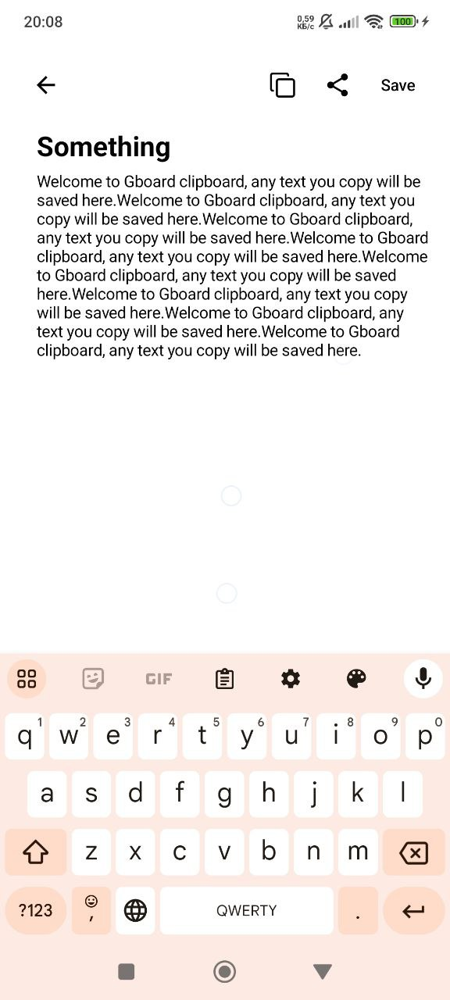

# Offline Notes - Android Native App

Welcome to the **Offline Notes** repository! This is a simple yet efficient note-taking application for Android that allows users to write, save, and organize notes offline. Built using modern Android technologies, this app leverages **Jetpack Compose** for the UI, **Room** for local storage, and follows a **Clean Architecture** to ensure scalability and maintainability.

---

### 📝 **App Overview**

**Offline Notes** is an Android application designed to help you create, store, and manage your notes offline. With a user-friendly interface powered by **Jetpack Compose** and a robust backend powered by **Room Database**, the app guarantees a smooth note-taking experience. Whether you're jotting down ideas or making a quick to-do list, **Offline Notes** provides a reliable and offline-first solution.

### 🚀 **Features**

- **Create Notes**: Easily add new notes with titles and descriptions.
- **Edit and Delete Notes**: Modify or remove any note at any time.
- **Offline Functionality**: Notes are saved locally and accessible offline using **Room**.
- **Clean UI with Jetpack Compose**: A modern and responsive UI built using **Jetpack Compose**.
- **Navigation with Voyager**: Smooth and structured navigation throughout the app with **Voyager**.
- **Search Notes**: Find your notes quickly using a search bar.
- **Organize Notes**: Categorize notes based on your needs (tags, titles).

---

### ⚙️ **Technologies Used**

This app leverages modern Android libraries and follows a clean architecture to ensure scalability and maintainability. The technologies used are:

- **Android Native**: Built natively using Kotlin and Android SDK.
- **Jetpack Compose**: UI components built with the declarative **Jetpack Compose**.
- **Room Database**: Local storage solution for saving and managing notes offline.
- **Voyager Navigation**: Used for managing screen navigation in a clean and modular way.
- **Clean Architecture**: Ensures separation of concerns and a maintainable codebase by following a layered architecture (presentation, domain, and data layers).
- **ViewModel & LiveData**: Manages UI-related data in a lifecycle-conscious manner.
- **Coroutines**: For asynchronous operations and background tasks.

<table>
  <tr>
    <td></td>
    <td></td>
    <td></td>
  </tr>
</table>
